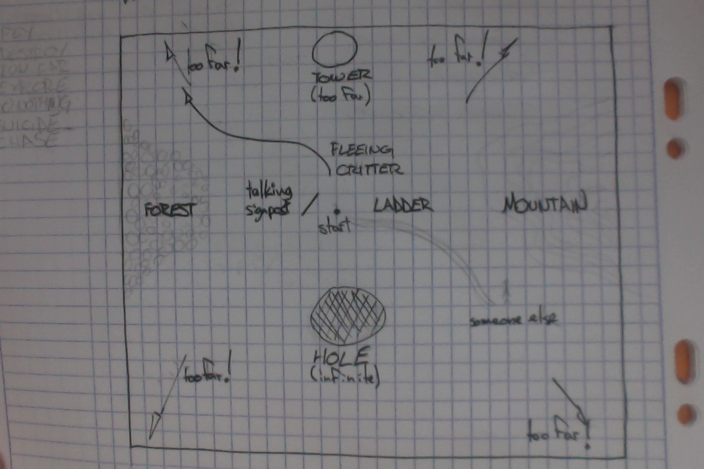

## 6.0 10/16/17

Aujourd'hui m'est arrivée une plaie que j'avais depuis longtemps prise comme était chose du passé. J'ai eu un gitfuck et j'ai perdu une journée de travail. Ça inclut la map et toute les images documentant mon travail. Je dois définitivement prendre du temps pour lire de la doc sur git et mieux comprendre ses rouages, parce que c'est la plus cruelle ironie que je perde tout mon travail en utilisant du version control.

Une chose à laquelle je dois m'habituer, commit le plus souvent possible. Ça suffit plus, le ctrl+s, c'est le cloud qui compte maintenant.

Bref. Avec une courte période de hurlement interne, j'ai décidé de mettre mon temps sur ma deuxième idée, baptisée _portes_.

L'idée de base, que j'ai rédigée deux semaines plus tôt:

>Une succession de salles épurées présentant un choix binaire. Une sorte de succession rapide de situations où le joueur doit choisir entre deux choses, sans contexte. Les choix sont basés dans la présentation des portes.

Je vais garder ce concept, à l'exception de rattacher un contexte à chaque situation.

Le jeu consistera en une série de vignettes séparées en scènes, chacune rattachée à une "expérience" différente.

Je n'ai pas encore de définition exacte d'"expérience", pour l'instant ça se décortique soit en mots-clé, genre:
* patience
* asdf

J'aurais peut-être envie d'arriver à quelque chose de plus "flavored" et surtout plus québécois.

## 5.0 - 11/10/17

Après une lourde semaine de lecture / écriture derrière moi, j'ai embarqué dans Unity.

Toujours commencer par l'échelle macro. Dans ce cas, je devais m'assurer que l'espace navigable en l'espace d'une minute était assez restreint, tout en donnant une impression d'immensité. Les obélisques bleus me servent de guides.

Derrière le spawnpoint se trouve un billboard (qui n'affiche encore rien). Le plan est de lui faire "dire" du nonsense pendant une minute. Derrière se trouve un ravin dans lequel on peut se jeter.

Les pierre tombales illustrent un concept que j'ai en tête qui s'apparente en fait à Orchids to Dusk. Chaque playthrough laisserait une trace, soit un corps, une tombe, etc. J'aime beaucoup l'idée de voir le "data" des morts être affiché.

J'ai fait une première passe de détails. À l'ouest, la forêt. Les montagnes à l'est. Le ravin au sud. Des rivières / lacs pour encadrer le parcours un peu plus.

J'aime l'idée d'avoir un lookout en hauteur comme option. C'est présentement possible de s'y rendre en 50 secondes, et de regarder de haut tout le reste de la map.

Je ne sais pas encore ce que je veux faire pour l'option forêt. J'aimerais peut-être y mettre une sihlouette de loin; avoir quelqu'un ou quelque chose qui ferait miroiter une possibilité d'interaction. Ou juste de la fumée? Juste piquer la curiosité du joueur.

Un problème que je vois arriver à l'horizon serait d'en offrir trop au début. Le joueur, surchargé d'information, resterait coincé dans l'hésitation. Je dois donc garder le début le plus épuré possible. Pour ça, je crois que je vais m'en tenir aux quatre points cardinaux:

* la tour au nord
* le lookout dans les montagnes à l'est
* la forêt à l'ouest
* le ravin au sud

À partir de ces options pourraient se rajouter quelques détails, mais pour l'instant je me limiterai à ça.

### Todolist
1. créer le timer
2. ~~trouver des assets qui fittent ma DA~~
3. scripter un panneau parlant
4. évaluer si un "fleeing critter" est envisageable
5. ~~implémenter le "trou" dans la forêt~~
6. ~~implémenter l'"échelle" dans les montagnes~~
7. ~~redisposer les trois chemins principaux en triangle (plutôt qu'en croix)~~

Et demain, je recommence à penser à mes portes...

***

### 4.0 - 09/10/17
Un monde ouvert entièrement naviguable avec seulement assez de temps pour aller à une seule destination.

Le joueur commence dans un open field. Le jeu se ferme dans une minute. Quel réflexe prend le dessus?

Cette idée m'est venue après la lecture de [Les luttes fécondes](http://edition.atelier10.ca/documents/les-luttes-fecondes) de Catherine Dorion. J'ai trouvé cet extrait très évocateur:
> La vie, c'est comme si un magicien nous envoyait au milieu d'un immense champ et nous disait "Voilà, vous avec une minute top chrono pour faire ce que vous voulez, et après, fini". Certains vont se mettre à courir le plus vite possible dans la même direction. D'autres vont rester sur place pour observer le mouvement du vent dans l'herbe. D'autres vont faire quelques pas à la recherche de quelque chose qui puisse les intéresser, apercevront une fourmis et prendront le reste de la minute à l'observer. D'autres feront la même chose, mais ne tomberont sur rien d'intéressant. Certains passeront leur minute à croiser des regards et des lèvres. D'autres crieront "Regardez, regardez, je suis meilleur que vous, trouvez-vous ? Et si je fais ça, comme ça, maintenant, trouvez-vous ? TROUVEZ-VOUS ?".

Ce jeu est aussi un peu inspiré de [Lovers at the End of the World](http://auntiepixelante.com/endoftheworld/) d'Anna Anthropy.

On a juste pas le temps de penser, ce sont nos réflexes qui prennent le dessus.

J'ai déjà plus d'idées concrètes avec cette idée de jeu. Au lieu du choix binaire, j'offre un choix ouvert.

J'ai plusieurs idées d'éléments présents dans la scène:
* Une tour à l'horizon. La tour prend une minute à rejoindre.
* Un panneau de signalisation juste à côté du spawn point. Le panneau s'adresse au joueur et cherche son attention.
* Une forêt à l'ouest. Des montagnes à l'est
* Un trou sans fond. Une échelle sans fin.
* Un (des?) lapin (ou quelconque animal) qui fuit au loin.

J'ai déjà commencé un mockup pour me donner une idée de l'échelle et de la répartition des éléments.

Les éléments principaux ont été étalés sur les quatre points cardinaux.

La seule chose qui m'inquiète avec cette approche est que les choix ne seront pas livrés de façon équitable, amenant le joueur à prendre une décision avant d'avoir pu voir l'ensemble de ce qui est possible. Peut-être que je devrais simplement assumer ça, aussi: le joueur pressé qui se lance sur le premier hameçon en vue, et le joueur plus posé qui regarde ce qui est possible. Ça embarque dans ma direction d'embranchement expressif.

Je ne suis pas certain du postprocess "gloomy" que j'ai actuellement. J'ai plutôt cette DA en tête: de quoi de paisible pour compenser le stress imposé par la pression de temps.

Le todolist pour la semaine prochaine serait donc de
1. créer le timer
2. trouver des assets qui fittent ma DA
3. scripter un panneau parlant
4. évaluer si un "fleeing critter" est envisageable
5. implémenter le "trou" dans la forêt
6. implémenter l'"échelle" dans les montagnes
7. redisposer les trois chemins principaux en triangle (plutôt qu'en croix)

***

## 3.0 - 05/10/17

Je veux centrer mon premier prototype autour de l'_embranchement expressif_: Donner un choix au joueur qui ne résulte non pas (forcément) en une conséquence, mais en plutôt une nuance reflétant sa propre personne.

J'ai deux avenues possible pour mon premier prototype.

### Idée I - Dilemnes
Une succession de salles épurées présentant un choix binaire.

Je suis intéressé à une sorte de succession rapide de sitaution où le joueur doit choisir entre deux choses, sans contexte. Les choix sont basés dans la présentation des portes.
* petite porte vs grande porte
* porte crasseuse vs porte nantie
* porte illuminée vs porte assombrie.

C'est définitivement un scénario _stanléen_, et ça m'énerve un peu.

Cette scène est le point névralgique de TSP, et la source de la satyre du jeu: la relation tumultueuse entre joueur et le créateur. La différence dans mon idée et que le contexte est encore plus absent: je me fie vraiment sur l'instinct du joueur, et son interprétation de l'environnement pour progresser. Les questions que je pose sont encore plus vagues: préfères-tu la grosse porte ou la petite porte? Gros ou petit? Est-ce que la taille compte?

On pourrait aussi comparer cette idée à l'une des scènes phares d'Antichamber.

Chaque escalier ramène le joueur au même choix. J'aime beaucoup le message de ce résultat: peu importe ta décision, ça ne change rien:
> The choice doesn't matter if the outcome is the same.

Cependant, la réflexion progresse; le joueur change à travers cette répétition. Après un "loop", un autre message apparaît:
> The choice can be as simple as going left or going right.

C'est pire qu'un choix sans conséquences: c'est un choix qui ramène à la même chose. La solution est d'abandonner et revenir sur ses pas. Sur le chemin du retour, le joueur constate que l'environnement a changé. Et la conclusion apparaît:
> When you return to where you have been, things aren't always as remembered.

C'était une scène sans issue, mais qui à contribué à faire évoluer la perspective du joueur.

J'ai créé un jeu l'an dernier, intitulé _Foire aux questions_, qui ressemble à cette idée. Le joueur doit passer à travers une succession de scènes.

Le concept est encore plus simple. Le jeu n'a aucun _branching_; chaque choix ne fait que faire progresser la trame linéaire du jeu. Cependant, j'aimais beaucoup voir ce que le joueur allait choisir pour se rendre jusqu'au bout. Certains choix (utilisant parfois des termes intimes ou ambigües) laissaient les joueurs hésiter. Et c'est à travers ces moments que l'expression du joueur se ressentait.

Fun fact: tous mes playtesters pensaient que leur choix avaient des conséquences sur le outcome du jeu. L'illusion du choix est quelque chose de puissant.

Ça me ramène à Mountain, qui permet un input au début du jeu, mais qui ne sert ultimement à rien. On s'imagine juste que tout se passe "dans la simulation".

Pour en revenir à mon idée de jeu, je suis un peu embêté, et je me sens bloqué.

J'ai du mal à trouvers des choix (ou dilemnes) intéressants. Mes idées de portes (ou d'escaliers) se rattachent trop directement à TSB et AC. Peut-être que je devrais m'en tenir à des choix plus absurdes et dépourvus de sens, et tout miser sur la confusion du joueur?

Pour l'instant, cul-de-sac: Je vais laisser l'idée sur mon backburner.

***

## 2.0 - 29/09/17
_Références_

Toujours dans l'optique de me donner un point de départ, j'ai décidé de me faire un bref top 3 des jeux qui m'ont beaucoup influencé dans leur façon de s'exprimer. D'emblée, ces trois exemples partagent plusieurs aspects ensemble. Ce sont trois classiques, bien connus depuis leur parution, et chacun ayant influencé de façon tangible le genre (suffit de voir tous les clones qui ont suivi).

Ce sont aussi trois jeu catégorisés "walking simulator", un terme qui implique une absence de mécaniques autre que le mouvement. Je crois définitivement avoir un faible pour ce genre, notamment dû à mon background en 3D mais aussi dû au fait que j'ai toujours trouvé ce genre plus dépendant de sa mise-en-scène qu'un genre avec une caméra plus passive, ou éloignée. J'aime le challenge qu'implique une caméra entièrement contrôlée par le joueur; ce sont 360 degrés d'information qui peuvent être appelés à tout moment. J'ai donc essayé de noter ce qui m'a spécifiquement influencé dans chacune de ces expériences.

### 2.1 - The Stanley Parable
Il y a quelques années, lorsque je faisait jouer ce jeu par mes élèves, j'étais toujours émerveillé de voir quel allait être les choix d'un.e joueur.euse durant sa première fois. Ce premier walkthrough, encore tout innocent, en dit long sur le joueur; suivras-tu les directives? Ou feras-tu systématiquement l'inverse de ce qu'on te demande de faire? Hésiteras-tu?

Le level designer est souvent appelé à donner des opportunités pour des expériences différentes dans un même niveau: le chemin "action" contre le chemin "stealth"; le chemin "difficile, mais rapide" contre le chemin "facile, mais plus long"; le chemin "close range" contre le chemin "long range". Chaque chemin à prendre est donc non seulement une opportunité pour le joueur de tailler le jeu à sa mesure, mais aussi d'exprimer son identité.

TSP se sert de ce même choix binaire, mais autrement. Le narrateur (et par extention le créateur du jeu) demande, implicitement: "me fais-tu confiance"? Et chaque choix qui suit ces deux portent ramènent à cette question.

Aussi, la direction artistique du jeu (un office space) est secondaire; elle ne contribue qu'à renforcer l'esthétique mindless, qui est déjà approchée par les directives du Narrateur tentant d'influencer le joueur. J'aime beaucoup cette distanciation du "contenu".

### 2.2 - The Beginner's Guide
Ici, contrairement à TSP, l'architecture est à l'avant-plan. Elle est le moteur principal de la narration en étant associée aux périodes d'une vie d'une personne. Le procédé est simple, mais terriblement efficace: un sentiment est juxtaposé à une scène.

Ces états d'esprit du personnage principal (Coda) sont véhiculés par la tramme narrative d'un gars fouillant dans les archives de quelqu'un. Cette approche "faux-documentaire" est ainsi l'excuse parfaite pour ficeler la suite de vignette avec peu ou pas de lien entre elles.

### 2.3 - Dear Esther
Dear Esther utilise également un espace expressif, mais de façon très différente. Au lieu d'assister à une série de vignettes, le joueur traverse un long niveau continu découpé en petits segments.

Tout est plus vague et ouvert à interprétation, mais l'environnement dépend tout autant du monologue du narrateur pour trouver l'ensemble de son potentiel esthétique. L'environnement (une île) se veut beaucoup plus réaliste, et c'est surtout à travers la mise-en-scène des éléments de l'île que la narration émane.

### 2.4 - Piliers
De ces exemples resortent deux tendances sur lesquelles j'aimerais appuyer ma recherche.

1.  embranchement expressif (_expressive branching_)
  * choix de parcours révélant un aspect ou une nuance chez le joueur
  * l'ajout de conséquence(s) à ce choix est optionel

2.  projection architecturale (_architectural projection_)
  * affichage externe d'états internes
  * selon le contexte, le meaning de l'espace se transforme

***

## 1.0 - 27/09/17
_Case départ_

### 1.1 - Source

J'ai quitté l'industrie du jeu triple-A il y a de ça trois ans, après une difficile période d'aliénation avec la création de jeux vidéo. Une longue phase d'introspection créative s'est ensuivie et m'a mené à comprendre que cet équeurement ne venait pas exactement d'une simple fatigue d'avoir trop travaillé ou à développer des jeux qui ne m'intéressaient plus. C'était en fait plus simple que ça: je me sentais isolé. Je me sentais incapable de m'exprimer dans ce que je créais, me rendant dangereusement détaché.

Ce détachement se trouvait quelque part entre le jeu que je co-créais (et le message qu'il transportait) et qui j'étais en tant que créateur. En d'autres mots, je créais des expériences fun™, épiques™ et immersives™ qui se limitaient à être une contribution (bien rémunérée, au moins) à un produit de divertissement de masse.

Si m'exprimer est ma priorité, je dois dans ce cas utiliser qui je suis comme source. Je dois trouver un certain reflet de moi relayé à une personne qui saurait s'y identifier, ou simplement être se sentir challengée par mon point de vue. Les expériences que je chercher à transmettre devraient ainsi être un relais entre moi et l'audience ou, pour emprunter les mots à McLuhan, une "extention" de qui je suis.

Ce désir de s'exprimer ne devrait pas non plus être à sens unique. Le médium du jeu vidéo implique un dialogue où l'expression du joueur vient répondre à celle du créateur.

Voici donc la préface de ma transition actuelle de développeur à artiste. Cependant, bien que ma vocation ait changé, mon métier est resté le même: je suis un concepteur de niveaux, et cette discipline est le véhicule de ma rhétorique.

Le problème dans tout ça est que je ne maîtrise pas du tout mon métier à travers cette nouvelle vocation.

### 1.2 - Problème

*How do I build a scene that reveals my character?*

Depuis le moment où j'ai commencé à créer des jeux, cette question m'habite, et sera la case départ de ce projet de recherche. J'ai l'intention d'explorer les différentes avenues par lesquelles je peux m'exprimer, et prioriser l'espace et la mise-en-scène sur les systèmes. Je dis ça parce que pour bien des designers, la conception de mécaniques vient à priori. C'est seulement ensuite, étant donné que ces mécaniques se doivent être représentées, que vient ce devoir de créer un espace qui sert ces mécaniques. En ce qui me concerne, le processus est inversé. La scène me vient d'abord, et les mécaniques viennent ensuite renforcer l'expérience.

### 1.3 - Vocabulaire

La conception de niveaux a traditionellement été une discipline avec des buts très directs: un map layout bien balancé; une livraison calculée de la trame narrative; un gunfight fair quoique challengeant, une distribution justifiée de covers...

L'aspect de la mise-en-scène appliquée aux jeux vidéo est très souvent complètement secondaire, voire carrément ignoré. Mes prochains prototypes devront ainsi être réalisés sous la lentille d'un level design sensible et expressif. Comment se définit un level design "sensible"? Je ne sais pas encore. Je dois chercher à me créer une base de principes et de mots sur laquelle je pourrai bâtir mon esthétique et mes idées futures.

***
