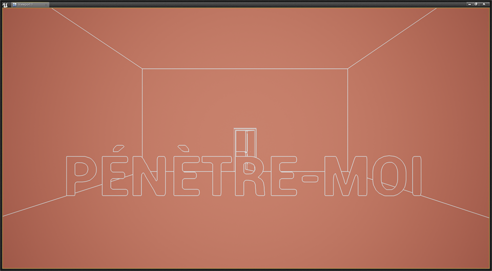
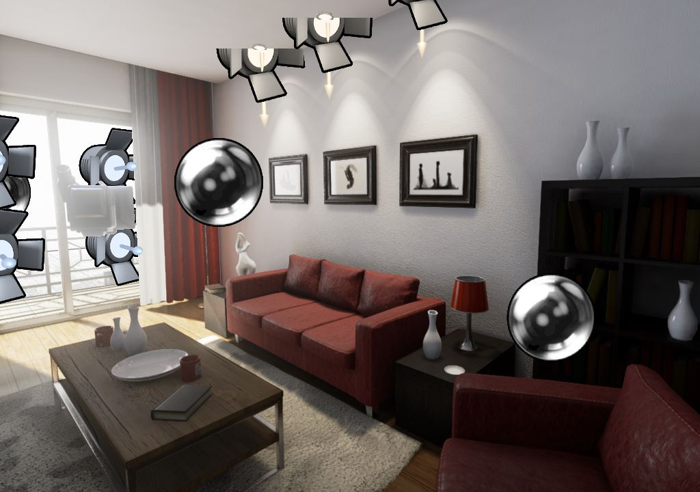
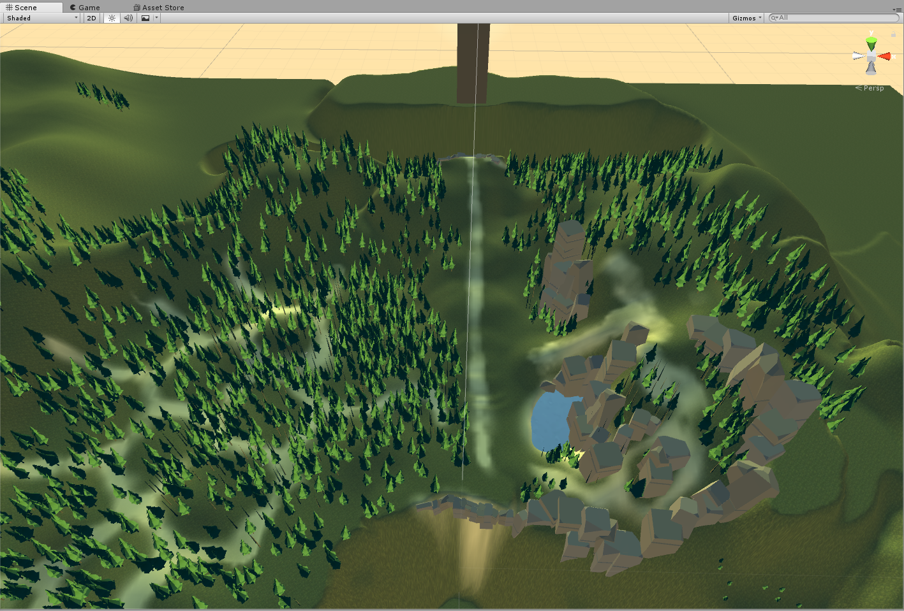
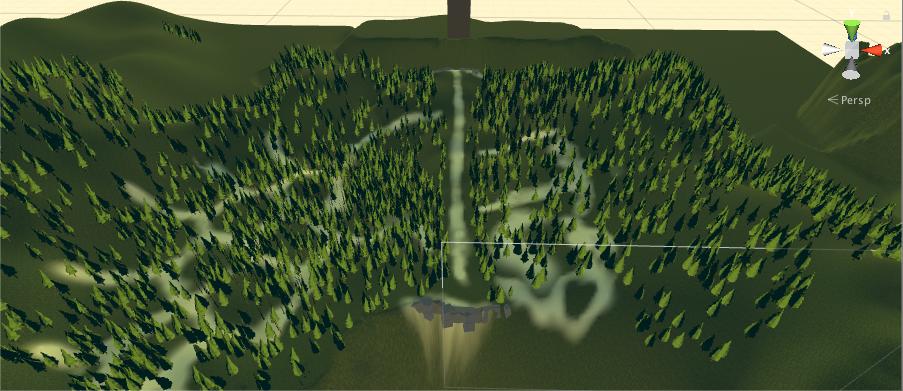
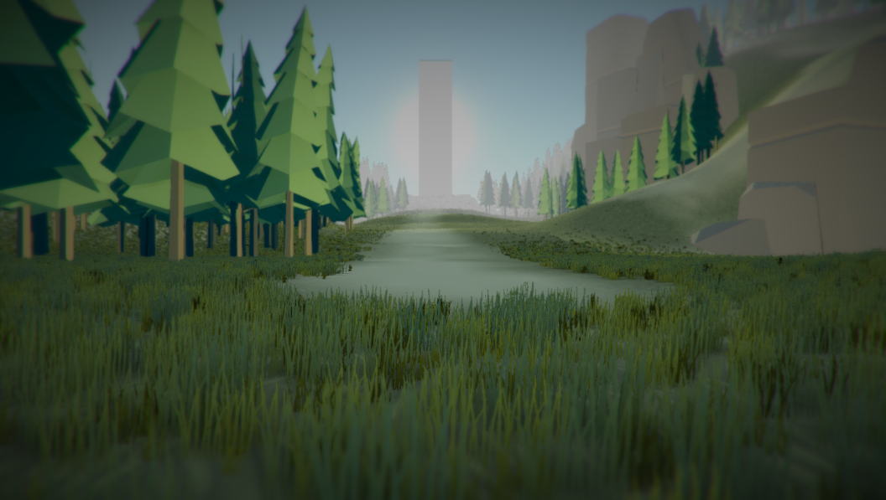
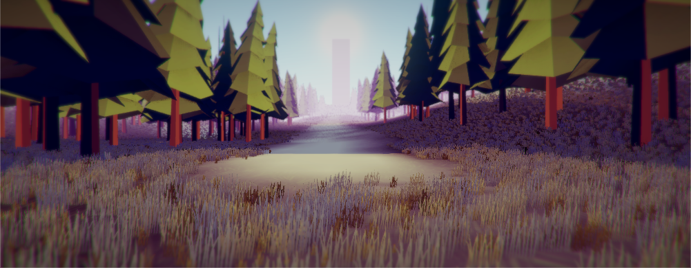

## 14.0 07/12/17 12:53
Vingt jours se sont passés depuis mon dernier log. Passé le premier jeu prévu pour ce independent study, j'ai eu une perte quasi-instantanée de momentum.

Mon deuxième jeu, codenamed _Doors_, a été une épide dans mon pied en ce dernier mois de la session d'automne. J'ai pris la décision, le weekend dernier, de l'abandonner, car travailler dessus devenait contre-productif. Au final, j'aurai eu deux débuts de jeu qui n'auront pas abouti, et je suis maintenant parti sur une troisième idée (parce que tsé, faut ben que j'arrive avec quelque chose au final).

### Idée I - le choix binaire
L'idée de base de _Doors_ était centrée autour de mon concept d'_embranchement expressif_: Donner un choix au joueur qui ne résulte non pas (forcément) en une conséquence, mais en plutôt une nuance reflétant sa propre personne.

En d'autres mots: le meaning venait de la décision même du joueur, et non de la conséquence dudit choix.

Je me suis donc dit que j'allais faire une succession de salles épurées présentant un choix binaire.

J'étais intéressé à une sorte de succession rapide de sitaution où le joueur doit choisir entre deux choses, sans contexte : une petite porte et une grande porte. Une porte illuminée et une porte assombie, etc.

L'idée ressemblait un peu à _Foire aux questions_, un jeu que j'ai créé l'an dernier.

Un jeu avec aucun _branching_; chaque choix ne fait que faire progresser la trame linéaire du jeu. Cependant, j'aimais beaucoup voir ce que le joueur allait choisir pour se rendre jusqu'au bout. Certains choix (utilisant parfois des termes intimes ou ambigües) laissaient les joueurs hésiter. Et c'est à travers ces moments que l'expression du joueur se ressentait.

Finalement: cul-de-sac. J'étais peu à l'aise avec ce choix parce qu'il me semblait trop axé sur The Stanley Parable. Je n'étais capable de citer que ce jeu en exemple et j'avais un mal fou à trouver de nouveaux choix intéressants.

### Idée II - la porte comme métaphore
J'ai ensuite fait volte-face pour explorer, sans intention précise, différentes interactions qu'on pourrait avoir face à une porte. Considérant le jeu dans le frame du "walking simulator", j'me suis dit qu'est-ce que je pourrais exprimer selon la position / orientation du joueur, et le désir de passer du point A au point B?

J'ai rempli une page et demie de portes avec différentes options.

Quelques exemples:
* une porte qui ne s'ouvrait que lorsque le joueur ne regardait pas
* une porte qui était franchissable que lorsqu'on entrait à reculon en elle
* une porte qui s'ouvrait que lorsque le joueur abandonnait (retournait sur ses pas, ou ouvrait le menu)
* une porte qui s'ouvrait sur un mur de briques
* une porte qui se fermait à mesure que le joueur s'approchait d'elle
* une porte qui s'ourait à mesure que le joueur s'éloignait d'elle
* une porte grande ouverte et des contrôles mélangés
* une porte grande ouverte et la vitesse du joueur qui ralentis au fur et à masure qu'il s'en approche

Le but était de créer un jeu via un processus _bottom-up_: avoir plusieurs idées d'interaction et de mécanique, et ensuite créer un contexte pour rattacher le tout.

J'avais donc toutes ces mécaniques, éparpillées, sans élément central. Je ne voulais pas présenter ces mécaniques sans aucun contexte, car je crois que le jeu aurait perdu une grande partie de son potentiel évocateur. J'ai longtemps pensé associer des étapes de ma vie amoureuse (souvent récurrente dans mes thèmes), pour donner un plus grand potentiel de métaphore aux portes, mais la connexion entre cette idée high level avec ces mécaniques low-level était toutefois trop faible.

Et puis voilà, j'ai rien trouvé de mieux. Il faut dire qu'à ce moment, j'étais enterré dans une pluie de travaux finaux qui faisaient en sorte que le brainstorm de solutions n'était pas efficace.

### Idée III - freestyle de portes
À court de solution, avec une deadline qui se rapprochait dangereusement, j'ai décidé de pivoter et de changer d'engin. Je suis revenu vers unreal, sachant que mon aisance technique allait m'aider à essayer autre chose.

J'ai décidé de _freestyler_. Créer une succession de salles, n'importe quoi, avec ou sans portes, et voir ce que ça donne. Je suis parvenu à un fini visuel particulier (wireframe sur background pastel) et j'ai créé une petite succession de salles.

Je désirais simplement créer quelque chose d'instinctif. Une succession de mots, de couleurs, et d'espaces abstraits, comme une pièce musicale qui n'a pas de "sens", mais qui transporte émotionellement.

J'ai fait un premier prototype qui s'est bien passé. L'expérience dure une minute. Le joueur passe d'une pièce à l'autre, dans des salles vides ponctuées de texte du genre "ouvre-moi", ou "suis-moi" et autres injonctions cryptiques. Je trouvais l'expérience agréable, mais je voyais aussi que c'était surtout un exercice de style, avec peu de substance au final. C'est le genre de projet que je me verrais continuer dans mon temps libre, mais dans le cadre d'un independent study, j'aurais été embêté d'analyser ce niveau.

Case départ à nouveau. J'avais besoin d'un message. Une idée qui allait frapper mon imagination au sujet du level design d'auteur.

### Idée IV - l'apartement
Toute cette timeline mène à aujourd'hui. Je suis à nouveau parti sur quelque chose de nouveau.

Je veux créer un espace qui se désintègre. Tranquillement, et sans aucune issue.

Je veux partir d'un espace réaliste; illusoire. Une pièce immersive, et convaincante qui perd tranquillement de sa façade.

Je veux recycler du contenu: la pièce en question est une démo intitulée "realistic rendering", fait par Epic Games. Je veux infuser un message à cette pièce qui, autrement, n'est qu'un showoff de technologie.

En ce sens, je veux lancer un message sur les limites du médium. Et l'acceptance de ces limites. Cet espace parfait et convainquant qui, peu à peu, perd ses textures, ses lumières, ses objets pour ne finalement devenir qu'une coquille vite. Et même cette coquille finirait par disparaître, jusqu'à ce que le joueur soit isolé sur un plancher, qui disparaîtrait également, laissant suite à une chute sans fin.

Cette pièce n'était au final qu'un cube flottant dans le vide.

Cette idée me ramène aux écrits de Clement Greenberg sur les courants romantique, impressioniste et cubiste en peinture, et de l'acceptation des limites du médium. Pourquoi cette course à l'illusion? Outre le potentiel d'immersion et de divertissement, j'y vois une perversion du médium, et d'un déni de ses limites. Un jeu est virtuel. Un jeu est un ensemble de mécaniques créant une dynamique avec la participation d'un joueur. Un jeu n'est pas vrai.

La semaine prochaine, je compte rajouter un script dans la salle qui va tranquillement faire disparaître le mobilier (et éventuellement les murs). Le script sera créé de sorte à ce que la "disparition" se fera toujours à l'insu du joueur (ex: pendant qu'il regarde ailleurs). Passé ce stade, je verrai ou est la prochaine étape.

***

## 13.0 17/11/17 5:55
Je vais résister à l'envie d'écrire sur le temps qui me manque et mes cours de BFA qui me drainent l'entièreté de mon temps, alors je vais tout de suite sauter dans le sujet.

Openfield, aka 60 secondes, aka Il ne te reste qu'une minute à vivre, est _à peu près_ terminé. _À peu près_ car je crois avoir trouvé le centre de mon message (notre désir automatique d'agir face au temps) qui est passablement est exprimé dans le prototype. _À peu près_ parce que chaque feature, chaque idée n'a pas vraiment pu être poussée jusqu'au bout.

J'ai beaucoup travaillé sur l'optimisation et sur certains détails qui m'intéressaient dans l'environnement (comme le chemin central, ou le ravin derrière le joueur).

Une des dernières modifications majeures apportée à l'environnement est d'avoir étendu la forêt partout. J'ai coupé la montagne pour standardiser ce qui n'était pas lié au chemin principal.

Avant

Après

Cette décision m'a à priori semblée paresseuse. Enlever la montagne et rajouter la  forêt m'a pris un gros 30 secondes à faire dans la nouvelle version, alors que de simpler _créer_ la montagne m'avait pris une soirée entière.

Je trouve que la différence est plus frappante vue de la perspective du joueur.

Avant

Après

Tout ça symbolise cependant un des réflexes constant de ma progression dans ce prototype, qui a été de progresser en soustrayant. C'est un principe limite cliché ("minimalist design", blabla) qui reste toutefois très difficile à appliquer. Du moins en ce qui me concerne; c'est facile de se dire que son jeu n'est "pas assez", de conclure que ça "manque de gameplay" et que la solution réside manifestement dans l'ajout de contenu.

C'est donc le retrait du contenu - ou carrément le retrait d'information - qui a mis de côté tout ce bruit qui était certes intéressant, mais qui ajoutait de la confusion au concept.

En surface, je crois que l'attrait de ce projet réside sur le mystère et la curiosité: _qu'est-ce qui se passe après 60 secondes? qu'est-ce qui se trouve au bout du chemin? je cherche quelque chose dans la forêt, mais quoi? est-ce que je peux revenir en arrière?_

Ce sont ces questions qui sont importantes plus que les réponses. C'est le "firstness" de la prémisse du jeu et la réponse émotionelle qu'on ressent lorsqu'on se fait donner une pression sévère de temps: l'anxiété de faire (ou atteindre) quelque chose avant qu'il ne soit trop tard; le FOMO lié à l'exploration; l'incapacité de ne rien faire. L'intérieur brut du joueur passe par ces décisions peu ou pas réfléchies, et c'est de là que sort toute la beauté d'un jeu.

## 12.0 27/10/17 19:21

J'ai plusieurs pistes quant à la suite.

J'me suis mis dans la tête que j'aimerais avoir une TV dans le jeu. Pour faire quoi? Je sais pas encore. Briser le 4e mur en expliquant les enjeux? Shouter du nonsense? Ou cryptiquement afficher le progrès: genre simplement afficher 0/10, sans expliquer ce qu'il y a à ramasser; juste de quoi pour piquer le nerf achiever à certains...

Du brouillard! Mapper la densité à la progression du joueur dans l'environnement? Ça signifierait que plus tu progresses, plus tu te perds, en fait. C'est un peu nihiliste comme vision. Peut-être que le brouillard pourrait être associé au timer. La métaphore serait alors moins associée aux actions / intentions, mais plus au temps.

J'ai cette idée latente de faire commencer le joueur dans un salon. La TV est là, et saurait quémander l'attention du joueur pendant les 60 secondes. À tout moment, le joueur pourrait kick down la porte et sortir sur le champs ouvert. J'aime bien cette idée de tenter de garder le joueur enfermé. Ce serait un clin d'oeil à la métaphone de la caverne de Platon.

## 11.0 27/10/17 19:21

Une nouvelle semaine qui se passe sans que je puisse donner un peu d'amour à ce journal. La recherche-création en parallèle avec un BFA est pesante; mes semaines passent avec cette envie qui décolle pas de pouvoir me pencher sur mes jeux, avec une tête claire et des idées plein les doigts.

Plusieurs update majeurs:

* **Je mets momentanément le projet Doors de côté pour me concentrer sur Openfield.** J'ai fait avancer ces projets en parallèle pour savoir lequel valait la peine d'être approfondi en priorité. J'ai notamment fait ce choix vu que j'ai du mal à trouver un fil conducteur intéressant pour Doors et que la tâche au niveau scripting s'avérait plus ardue. Openfield avancera plus vite à partir de maintenant.

* **Openfield est fonctionnel et jouable.** J'ai créé une build lundi avec laquelle j'ai pu faire un peu de playtest. C'est possible d'y jouer [http://saboudreault.ca/jeux/of/index.html](ici).

Ces quelques playtests m'ont amené à quelques réflexions.

**60 secondes pour jouer, c'est intense.** Dans tous mes playtests initiaux, le joueur a rapidement paniqué et s'est engagé dans la première avenue disponible.

J'ai trouvé ce réflexe problématique car les choix effectués à ce moment étaient au hasard. Je rappelle que le but de ce jeu est de donner un reflet de celui ou celle qui y joue à partir de ses réflexes les plus naturels. Le timer donne un poids à ce choix: ton temps est limité, tu ne peux pas tout faire, alors sers-toi en à bon escient.

Ça m'a mené à me poser la question **et si le timer avançait seulement quand le joueur avançait?**

J'ai récemment joué à _Lullaby for a Heartsick Spacer_. Quelle belle gemme. Dans le jeu, on se promène dans une grotte et on y choisit un endroit où dormir. C'est tout. Tout comme _Orchids to Dusk_, cette invitation à s'arrêter et ne rien faire m'a frappé. Ne rien faire est une des choses les plus contre-intuitives que je peux imaginer dans un jeu vidéo.

Ne rien faire fit quand même avec mon idée. Bien que contre-intuitif, c'est un choix qui est possible, et j'aimerais pouvoir lui donner plus de place dans ce jeu. J'ai donc pris une partie de la journée à scripter un timer qui n'avance pas si le joueur reste immobile. Après un nouveau playtest, j'ai pu voir un changement dans la dynamique du jeu.

La pression de temps devient tout de suite une situation moins urgente et stressante, mais garde quand même l'aspect "précieux" du temps imparti.

J'aime ça. C'est dur de ne rien faire, et je peux en témoigner quelque chose. Je fais des retraites de méditation depuis quelques années, et rester assis sur mon cul les yeux fermés à observer ma respiration toute la journée reste un des challenges les plus difficiles que j'ai pu entreprendre. Ne rien faire distortionne le temps. L'ennui c'est la conscience du temps.

Tu t'arrêtes pour stopper le timer, mais tu veux tout de suite repartir. Sprinter. Tu veux voir la suite, tu veux te rendre au sommet, tu veux trouver ce que tu cherches, tu veux compléter ce que d'autres n'ont pas pu.

S'arrêter est la solution à ce jeu qui délaisse néammoins le joueur sur une tension qui ne se résoud pas.

## 10.0 10/19/17 19:44

LONGUE journée de gossage sur Github. Merci à Saint-Julian, j'ai arrangé mes problèmes (en grande partie reliés à mon .gitignore) et je peux me lancer le coeur léger sur mes protos.

Aujourd'hui a essentiellement été une journée de mise-à-niveau sur C# et de tutoriaux sur internet. J'ai maintenant un menu fonctionnel et des transitions smooth entre deux scènes et un menu.

## 9.0 19/10/17 11:00

### DOORS SHORTLIST

**push n' pull**
* une porte devant, une porte derrière. L'ouverture de la porte dépend de la position du joueur.
* plus le joueur s'approche d'une porte, plus celle-ci se ferme. Plus il s'éloigne, plus elle s'ouvre.

**fausses portes**
* [4] portes fermées. Toutes sauf cachent un mur de briques.
* un seul bon choix est disponible, mais aucun indice n'est fourni.

**lookat**
* la porte est ouverte seulement quand le joueur ne la regarde pas.
* inversement: la porte est fermée seulement quand le joueur ne la regarde pas.

**noclip**
* la porte est constamment fermée
* elle perd sa collision quand le joueur ne la regarde pas
* le joueur peut ainsi passer à travers à reculons

**portails 1**
* plusieurs portes donnent à différentes destinations
* exemple: une porte donne vers un paysage ensoleillé, une autre vers un paysage marécageux

**portails 2**
* plusieurs portes ramènent à d'autres portes
* résultat: labyrinthe

**barricades**
* portes barrées, barricadées, booby-trappées

**coercion**
* Ordonner au joueur une décision. Le choix est entre les mains du joueur.
* "Stanley took the door on the left"

**taille**
* différentes portes de différentes formes

**patience**
* porte barrée. elle ne s'ouvre que lorsque le joueur abandonne
* abandon: sortir de la salle? ouvrir le menu?

**contrôles hackés**
* choix simple et direct offert.
* les contrôles sont déréglés.
* exemple: le input pour aller devant fait maintenant reculer

**innaccessible**
* la porte est ouverte, mais innaccessible

## 8.0 18/10/17 18:44

J'ai recommencé tantôt la scène de mon open field. Étant donné que j'ai dû tout recommencer, j'ai fait quelques modifs sur cette nouvelle version.

Version 1.0

Version 1.1

Si je fais le jeu des différences vite vite, l'échelle a changé à plusieurs endroits.
* J'ai enlevé les montagnes à l'horizon. Je préfère une horizon fixe à hauteur des yeux
* La forêt s'est transformée en labyrinthe. Au lieu d'en faire un chemin droit, je plutôt faire un dédale
* la falaise est vraiment, _vraiment_ collée sur le spawn. Genre quelques pas en arrière et c'est la chute.
* J'ai encore une rivière plus délimiter la forêt. Plus mince. Je la mettrai peut-être plutôt du côté de la montagne, pour ainsi mettre l'emphase sur la lisière dense de la forêt.

Vue de la montagne à partir du spawn. Au sommet se trouverait une structure, ou autre dominant avec un visuel catchy.

Vue de la forêt à partir du spawn. J'ai présentement deux entrées différentes.

Mes questionnements:
* Plus j'avance dans ce projet, plus je cherche à restreindre et clarifier la quantité de choix disponible à tout moment. Idéalement, ça devrait constamment être binaire. Avoir quatre directions différentes du début est peut-être trop.
* Et si je faisais une version avec rien devant, rien derrière, et seulement la forêt / montagne comme choix?
* Chaque direction devrait représenter quelque chose, et ce "quelque chose" devra être représenté quelque part entre la navigation du joueur et son processus de choix.

## 7.0 18/10/17 16:27

J'ai ma première scène fonctionelle pour Portes.

Le code est smooth, et flexible (importé via le package DoorsPro sur le assetstore). Je devrais facilement pouvoir itérer mes différentes idées à partir de ça.

Je vais devoir trouver un meilleur default size pour la salle à deux portes. Je devrai faire plusieurs tests d'échelle.

Aussi, mon legokit SUCK. Faut je trouve des alternatives. Pas chères. Genre vraiment pas chères.

## 6.0 16/10/17

Aujourd'hui m'est arrivée une plaie que j'avais depuis longtemps prise comme était chose du passé. J'ai eu un gitfuck et j'ai perdu une journée de travail. Ça inclut la map et toute les images documentant mon travail. Je dois définitivement prendre du temps pour lire de la doc sur git et mieux comprendre ses rouages, parce que c'est la plus cruelle ironie que je perde tout mon travail en utilisant du version control.

Une chose à laquelle je dois m'habituer, commit le plus souvent possible. Ça suffit plus, le ctrl+s, c'est le cloud qui compte maintenant.

Bref. Avec une courte période de hurlement interne, j'ai décidé de mettre mon temps sur ma deuxième idée, baptisée _portes_.

L'idée de base, que j'ai rédigée deux semaines plus tôt:

>Une succession de salles épurées présentant un choix binaire. Une sorte de succession rapide de situations où le joueur doit choisir entre deux choses, sans contexte. Les choix sont basés dans la présentation des portes.

Je vais garder ce concept, à l'exception de rattacher un contexte à chaque situation.

Le jeu consistera en une série de vignettes séparées en scènes, chacune rattachée à une "expérience" différente.

Je n'ai pas encore de définition exacte d'"expérience", pour l'instant ça se décortique en un brainstorm de mots-clé, genre:
* patience
* exclusivité
* push & pull
* i need space
* m'aimes-tu?
* greener pastures

C'est vraiment désorganisé, et je n'ai pas de ligne directrice pour l'instant. Looking forward, j'aimerais trouver ce fil conducteur, qui idéalement aura un vibe "québécois". Donc peut-être une liste d'expressions locales?

Pour les idées de mécaniques, j'ai sketché toutes sortes de situations. Certaines sont déjà rattachées à une émotion / phrase / expérience, d'autres sont juste encore au stade d'idée.

La prochaine étape sera de faire une shortlist de ces idées.

Autre piste de réflexion: comment est-ce que je wrap le tout?  Une liste de keywords affichée sur un menu? Une succession linéaire avec une certaine trame narrative?

## 5.0 - 11/10/17
Après une lourde semaine de lecture / écriture derrière moi, j'ai embarqué dans Unity.

Toujours commencer par l'échelle macro. Dans ce cas, je devais m'assurer que l'espace navigable en l'espace d'une minute était assez restreint, tout en donnant une impression d'immensité. Les obélisques bleus me servent de guides.

Derrière le spawnpoint se trouve un billboard (qui n'affiche encore rien). Le plan est de lui faire "dire" du nonsense pendant une minute. Derrière se trouve un ravin dans lequel on peut se jeter.

Les pierre tombales illustrent un concept que j'ai en tête qui s'apparente en fait à Orchids to Dusk. Chaque playthrough laisserait une trace, soit un corps, une tombe, etc. J'aime beaucoup l'idée de voir le "data" des morts être affiché.

J'ai fait une première passe de détails. À l'ouest, la forêt. Les montagnes à l'est. Le ravin au sud. Des rivières / lacs pour encadrer le parcours un peu plus.

J'aime l'idée d'avoir un lookout en hauteur comme option. C'est présentement possible de s'y rendre en 50 secondes, et de regarder de haut tout le reste de la map.

Je ne sais pas encore ce que je veux faire pour l'option forêt. J'aimerais peut-être y mettre une sihlouette de loin; avoir quelqu'un ou quelque chose qui ferait miroiter une possibilité d'interaction. Ou juste de la fumée? Juste piquer la curiosité du joueur.

Un problème que je vois arriver à l'horizon serait d'en offrir trop au début. Le joueur, surchargé d'information, resterait coincé dans l'hésitation. Je dois donc garder le début le plus épuré possible. Pour ça, je crois que je vais m'en tenir aux quatre points cardinaux:

* la tour au nord
* le lookout dans les montagnes à l'est
* la forêt à l'ouest
* le ravin au sud

À partir de ces options pourraient se rajouter quelques détails, mais pour l'instant je me limiterai à ça.

### Todolist
1. créer le timer
2. ~~trouver des assets qui fittent ma DA~~
3. scripter un panneau parlant
4. évaluer si un "fleeing critter" est envisageable
5. ~~implémenter le "trou" dans la forêt~~
6. ~~implémenter l'"échelle" dans les montagnes~~
7. ~~redisposer les trois chemins principaux en triangle (plutôt qu'en croix)~~

Et demain, je recommence à penser à mes portes...

***

### 4.0 - 09/10/17
Un monde ouvert entièrement naviguable avec seulement assez de temps pour aller à une seule destination.

Le joueur commence dans un open field. Le jeu se ferme dans une minute. Quel réflexe prend le dessus?

Cette idée m'est venue après la lecture de [Les luttes fécondes](http://edition.atelier10.ca/documents/les-luttes-fecondes) de Catherine Dorion. J'ai trouvé cet extrait très évocateur:
> La vie, c'est comme si un magicien nous envoyait au milieu d'un immense champ et nous disait "Voilà, vous avec une minute top chrono pour faire ce que vous voulez, et après, fini". Certains vont se mettre à courir le plus vite possible dans la même direction. D'autres vont rester sur place pour observer le mouvement du vent dans l'herbe. D'autres vont faire quelques pas à la recherche de quelque chose qui puisse les intéresser, apercevront une fourmis et prendront le reste de la minute à l'observer. D'autres feront la même chose, mais ne tomberont sur rien d'intéressant. Certains passeront leur minute à croiser des regards et des lèvres. D'autres crieront "Regardez, regardez, je suis meilleur que vous, trouvez-vous ? Et si je fais ça, comme ça, maintenant, trouvez-vous ? TROUVEZ-VOUS ?".

Ce jeu est aussi un peu inspiré de [Lovers at the End of the World](http://auntiepixelante.com/endoftheworld/) d'Anna Anthropy.

On a juste pas le temps de penser, ce sont nos réflexes qui prennent le dessus.

J'ai déjà plus d'idées concrètes avec cette idée de jeu. Au lieu du choix binaire, j'offre un choix ouvert.

J'ai plusieurs idées d'éléments présents dans la scène:
* Une tour à l'horizon. La tour prend une minute à rejoindre.
* Un panneau de signalisation juste à côté du spawn point. Le panneau s'adresse au joueur et cherche son attention.
* Une forêt à l'ouest. Des montagnes à l'est
* Un trou sans fond. Une échelle sans fin.
* Un (des?) lapin (ou quelconque animal) qui fuit au loin.

J'ai déjà commencé un mockup pour me donner une idée de l'échelle et de la répartition des éléments.

Les éléments principaux ont été étalés sur les quatre points cardinaux.

La seule chose qui m'inquiète avec cette approche est que les choix ne seront pas livrés de façon équitable, amenant le joueur à prendre une décision avant d'avoir pu voir l'ensemble de ce qui est possible. Peut-être que je devrais simplement assumer ça, aussi: le joueur pressé qui se lance sur le premier hameçon en vue, et le joueur plus posé qui regarde ce qui est possible. Ça embarque dans ma direction d'embranchement expressif.

Je ne suis pas certain du postprocess "gloomy" que j'ai actuellement. J'ai plutôt cette DA en tête: de quoi de paisible pour compenser le stress imposé par la pression de temps.

Le todolist pour la semaine prochaine serait donc de
1. créer le timer
2. trouver des assets qui fittent ma DA
3. scripter un panneau parlant
4. évaluer si un "fleeing critter" est envisageable
5. implémenter le "trou" dans la forêt
6. implémenter l'"échelle" dans les montagnes
7. redisposer les trois chemins principaux en triangle (plutôt qu'en croix)

***

## 3.0 - 05/10/17

Je veux centrer mon premier prototype autour de l'_embranchement expressif_: Donner un choix au joueur qui ne résulte non pas (forcément) en une conséquence, mais en plutôt une nuance reflétant sa propre personne.

J'ai deux avenues possible pour mon premier prototype.

### Idée I - Dilemnes
Une succession de salles épurées présentant un choix binaire.

Je suis intéressé à une sorte de succession rapide de sitaution où le joueur doit choisir entre deux choses, sans contexte. Les choix sont basés dans la présentation des portes.
* petite porte vs grande porte
* porte crasseuse vs porte nantie
* porte illuminée vs porte assombrie.

C'est définitivement un scénario _stanléen_, et ça m'énerve un peu.

Cette scène est le point névralgique de TSP, et la source de la satyre du jeu: la relation tumultueuse entre joueur et le créateur. La différence dans mon idée et que le contexte est encore plus absent: je me fie vraiment sur l'instinct du joueur, et son interprétation de l'environnement pour progresser. Les questions que je pose sont encore plus vagues: préfères-tu la grosse porte ou la petite porte? Gros ou petit? Est-ce que la taille compte?

On pourrait aussi comparer cette idée à l'une des scènes phares d'Antichamber.

Chaque escalier ramène le joueur au même choix. J'aime beaucoup le message de ce résultat: peu importe ta décision, ça ne change rien:
> The choice doesn't matter if the outcome is the same.

Cependant, la réflexion progresse; le joueur change à travers cette répétition. Après un "loop", un autre message apparaît:
> The choice can be as simple as going left or going right.

C'est pire qu'un choix sans conséquences: c'est un choix qui ramène à la même chose. La solution est d'abandonner et revenir sur ses pas. Sur le chemin du retour, le joueur constate que l'environnement a changé. Et la conclusion apparaît:
> When you return to where you have been, things aren't always as remembered.

C'était une scène sans issue, mais qui à contribué à faire évoluer la perspective du joueur.

J'ai créé un jeu l'an dernier, intitulé _Foire aux questions_, qui ressemble à cette idée. Le joueur doit passer à travers une succession de scènes.

Le concept est encore plus simple. Le jeu n'a aucun _branching_; chaque choix ne fait que faire progresser la trame linéaire du jeu. Cependant, j'aimais beaucoup voir ce que le joueur allait choisir pour se rendre jusqu'au bout. Certains choix (utilisant parfois des termes intimes ou ambigües) laissaient les joueurs hésiter. Et c'est à travers ces moments que l'expression du joueur se ressentait.

Fun fact: tous mes playtesters pensaient que leur choix avaient des conséquences sur le outcome du jeu. L'illusion du choix est quelque chose de puissant.

Ça me ramène à Mountain, qui permet un input au début du jeu, mais qui ne sert ultimement à rien. On s'imagine juste que tout se passe "dans la simulation".

Pour en revenir à mon idée de jeu, je suis un peu embêté, et je me sens bloqué.

J'ai du mal à trouvers des choix (ou dilemnes) intéressants. Mes idées de portes (ou d'escaliers) se rattachent trop directement à TSB et AC. Peut-être que je devrais m'en tenir à des choix plus absurdes et dépourvus de sens, et tout miser sur la confusion du joueur?

Pour l'instant, cul-de-sac: Je vais laisser l'idée sur mon backburner.

***

## 2.0 - 29/09/17
_Références_

Toujours dans l'optique de me donner un point de départ, j'ai décidé de me faire un bref top 3 des jeux qui m'ont beaucoup influencé dans leur façon de s'exprimer. D'emblée, ces trois exemples partagent plusieurs aspects ensemble. Ce sont trois classiques, bien connus depuis leur parution, et chacun ayant influencé de façon tangible le genre (suffit de voir tous les clones qui ont suivi).

Ce sont aussi trois jeu catégorisés "walking simulator", un terme qui implique une absence de mécaniques autre que le mouvement. Je crois définitivement avoir un faible pour ce genre, notamment dû à mon background en 3D mais aussi dû au fait que j'ai toujours trouvé ce genre plus dépendant de sa mise-en-scène qu'un genre avec une caméra plus passive, ou éloignée. J'aime le challenge qu'implique une caméra entièrement contrôlée par le joueur; ce sont 360 degrés d'information qui peuvent être appelés à tout moment. J'ai donc essayé de noter ce qui m'a spécifiquement influencé dans chacune de ces expériences.

### 2.1 - The Stanley Parable
Il y a quelques années, lorsque je faisait jouer ce jeu par mes élèves, j'étais toujours émerveillé de voir quel allait être les choix d'un.e joueur.euse durant sa première fois. Ce premier walkthrough, encore tout innocent, en dit long sur le joueur; suivras-tu les directives? Ou feras-tu systématiquement l'inverse de ce qu'on te demande de faire? Hésiteras-tu?

Le level designer est souvent appelé à donner des opportunités pour des expériences différentes dans un même niveau: le chemin "action" contre le chemin "stealth"; le chemin "difficile, mais rapide" contre le chemin "facile, mais plus long"; le chemin "close range" contre le chemin "long range". Chaque chemin à prendre est donc non seulement une opportunité pour le joueur de tailler le jeu à sa mesure, mais aussi d'exprimer son identité.

TSP se sert de ce même choix binaire, mais autrement. Le narrateur (et par extention le créateur du jeu) demande, implicitement: "me fais-tu confiance"? Et chaque choix qui suit ces deux portent ramènent à cette question.

Aussi, la direction artistique du jeu (un office space) est secondaire; elle ne contribue qu'à renforcer l'esthétique mindless, qui est déjà approchée par les directives du Narrateur tentant d'influencer le joueur. J'aime beaucoup cette distanciation du "contenu".

### 2.2 - The Beginner's Guide
Ici, contrairement à TSP, l'architecture est à l'avant-plan. Elle est le moteur principal de la narration en étant associée aux périodes d'une vie d'une personne. Le procédé est simple, mais terriblement efficace: un sentiment est juxtaposé à une scène.

Ces états d'esprit du personnage principal (Coda) sont véhiculés par la tramme narrative d'un gars fouillant dans les archives de quelqu'un. Cette approche "faux-documentaire" est ainsi l'excuse parfaite pour ficeler la suite de vignette avec peu ou pas de lien entre elles.

### 2.3 - Dear Esther
Dear Esther utilise également un espace expressif, mais de façon très différente. Au lieu d'assister à une série de vignettes, le joueur traverse un long niveau continu découpé en petits segments.

Tout est plus vague et ouvert à interprétation, mais l'environnement dépend tout autant du monologue du narrateur pour trouver l'ensemble de son potentiel esthétique. L'environnement (une île) se veut beaucoup plus réaliste, et c'est surtout à travers la mise-en-scène des éléments de l'île que la narration émane.

### 2.4 - Piliers
De ces exemples resortent deux tendances sur lesquelles j'aimerais appuyer ma recherche.

1.  embranchement expressif (_expressive branching_)
  * choix de parcours révélant un aspect ou une nuance chez le joueur
  * l'ajout de conséquence(s) à ce choix est optionel

2.  projection architecturale (_architectural projection_)
  * affichage externe d'états internes
  * selon le contexte, le meaning de l'espace se transforme

***

## 1.0 - 27/09/17
_Case départ_

### 1.1 - Source

J'ai quitté l'industrie du jeu triple-A il y a de ça trois ans, après une difficile période d'aliénation avec la création de jeux vidéo. Une longue phase d'introspection créative s'est ensuivie et m'a mené à comprendre que cet équeurement ne venait pas exactement d'une simple fatigue d'avoir trop travaillé ou à développer des jeux qui ne m'intéressaient plus. C'était en fait plus simple que ça: je me sentais isolé. Je me sentais incapable de m'exprimer dans ce que je créais, me rendant dangereusement détaché.

Ce détachement se trouvait quelque part entre le jeu que je co-créais (et le message qu'il transportait) et qui j'étais en tant que créateur. En d'autres mots, je créais des expériences fun™, épiques™ et immersives™ qui se limitaient à être une contribution (bien rémunérée, au moins) à un produit de divertissement de masse.

Si m'exprimer est ma priorité, je dois dans ce cas utiliser qui je suis comme source. Je dois trouver un certain reflet de moi relayé à une personne qui saurait s'y identifier, ou simplement être se sentir challengée par mon point de vue. Les expériences que je chercher à transmettre devraient ainsi être un relais entre moi et l'audience ou, pour emprunter les mots à McLuhan, une "extention" de qui je suis.

Ce désir de s'exprimer ne devrait pas non plus être à sens unique. Le médium du jeu vidéo implique un dialogue où l'expression du joueur vient répondre à celle du créateur.

Voici donc la préface de ma transition actuelle de développeur à artiste. Cependant, bien que ma vocation ait changé, mon métier est resté le même: je suis un concepteur de niveaux, et cette discipline est le véhicule de ma rhétorique.

Le problème dans tout ça est que je ne maîtrise pas du tout mon métier à travers cette nouvelle vocation.

### 1.2 - Problème

*How do I build a scene that reveals my character?*

Depuis le moment où j'ai commencé à créer des jeux, cette question m'habite, et sera la case départ de ce projet de recherche. J'ai l'intention d'explorer les différentes avenues par lesquelles je peux m'exprimer, et prioriser l'espace et la mise-en-scène sur les systèmes. Je dis ça parce que pour bien des designers, la conception de mécaniques vient à priori. C'est seulement ensuite, étant donné que ces mécaniques se doivent être représentées, que vient ce devoir de créer un espace qui sert ces mécaniques. En ce qui me concerne, le processus est inversé. La scène me vient d'abord, et les mécaniques viennent ensuite renforcer l'expérience.

### 1.3 - Vocabulaire

La conception de niveaux a traditionellement été une discipline avec des buts très directs: un map layout bien balancé; une livraison calculée de la trame narrative; un gunfight fair quoique challengeant, une distribution justifiée de covers...

L'aspect de la mise-en-scène appliquée aux jeux vidéo est très souvent complètement secondaire, voire carrément ignoré. Mes prochains prototypes devront ainsi être réalisés sous la lentille d'un level design sensible et expressif. Comment se définit un level design "sensible"? Je ne sais pas encore. Je dois chercher à me créer une base de principes et de mots sur laquelle je pourrai bâtir mon esthétique et mes idées futures.

***
